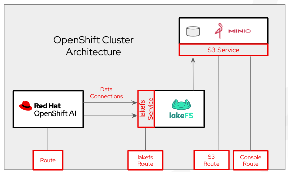

# Overview

[LakeFS](https://lakefs.io/) is a data versioning application that brings git-like versioning to object storage. It can interface with many object storage applications on the backend, and provide a S3 API gateway for object storage clients to connect to. In this demo, we'll configure OpenShift AI to connect over S3 interace to LakeFS, which will version the data in a backend [MinIO](https://min.io/docs/minio/kubernetes/openshift/index.html) instance.



# LakeFS with OpenShift AI Demo

The following steps should be followed to perform the [Fraud Detection demo](https://docs.redhat.com/en/documentation/red_hat_openshift_ai_self-managed/2.13/html/openshift_ai_tutorial_-_fraud_detection_example/index) on OpenShift AI, with LakeFS used for object storage management.

## Prerequisites

1. Bring up [OpenShift cluster](https://docs.redhat.com/en/documentation/openshift_container_platform/4.17#Install)
2. Install [OpenShift Service Mesh](https://docs.openshift.com/container-platform/4.16/service_mesh/v2x/installing-ossm.html#ossm-install-ossm-operator_installing-ossm), [OpenShift Serverless](https://docs.openshift.com/serverless/1.34/install/install-serverless-operator.html) and [OpenShift Pipelines](https://docs.openshift.com/pipelines/1.16/install_config/installing-pipelines.html) on the OpenShift cluster
3. Install [OpenShift AI](https://docs.redhat.com/en/documentation/red_hat_openshift_ai_self-managed/2.13/html/installing_and_uninstalling_openshift_ai_self-managed/index) on the OpenShift cluster
4. Install the `oc` OpenShift [CLI client](https://docs.openshift.com/container-platform/4.16/cli_reference/openshift_cli/getting-started-cli.html) on a machine thas access to the cluster

## Deploy and Configure the Environment
From the client machine, authenticate the `oc` client.

```
oc login <cluster_api_url> -u kubeadmin -p <admin_pw>
```

### Create a `lakefs` project in OpenShift.

```
oc new-project lakefs
```

### Clone the LakeFS samples repo
Clone the [lakeFS-samples.git](https://github.com/treeverse/lakeFS-samples.git) repository and change into the newly created directory.

```
git clone https://github.com/treeverse/lakeFS-samples.git

cd lakeFS-samples/red-hat-openshift-ai/cluster-configuration
```

### Deploy MinIO
Deploy MinIO in the `lakefs` project using the `minio-via-lakefs.yaml` file.

```
oc apply -f minio-via-lakefs.yaml
```
A random MinIO root user and password will be generated, stored in a `secret`, and used to populate MinIO with three storage buckets:
* **my-storage** 
* **pipeline artifacts**
* **quickstart**


### Deploy LakeFS
Deploy LakeFS in the **lakefs** project using the `lakefs-minio.yaml` file. This yaml will not only deploy lakefs but also:
* connect it with minio buckets created earlier
* create two lakefs repo:
  * **quickstart:** as a sample data repo
  * **my-storage** which is connected to backed my-storage s3 bucket created earlier


```
oc apply -f lakefs-minio.yaml
```
Lakefs credentials if needed:
* **User**: admin
* **Access Key**: something
* **Secret Access Key**: simple

### Access OpenShift AI Console
From the OpenShift web console, you can now open the OpenShift AI web console as shown below.


### Create a Data Science Project
After logging in to the OpenShift AI web console, follow the arrows below to create a new Data Science Project called **lakefs**.


## Fraud Detection Demo

You may now run through the [Fraud Detection demo](https://docs.redhat.com/en/documentation/red_hat_openshift_ai_self-managed/2.13/html/openshift_ai_tutorial_-_fraud_detection_example/index) in the new **lakefs** data science project. 

NOTES: 
* Use the `lakefs` data science project for the demo. You do not need to create a new project.
* When going through the demo, follow the steps to manually configure the storage data connections. **Do not** follow steps that use a script to automate the MinIO storage deployment, configuration and data connections. 
* When cloning the notebooks from the git repo in to the workbench, be sure to pull them from the `lakeFS-samples` repo as the notebooks there have been modified from the default notebooks to incorporate LakeFS. Do not use the notebook git repos shown in the demo. 


See [LakeFS documentation](https://docs.lakefs.io/) and [MinIO documentation for OpenShift](https://min.io/docs/minio/kubernetes/openshift/index.html) for details.

# File Descriptions

- [lakefs-local.yaml](./lakefs-local.yaml): Bring up LakeFS using local object storage. This would be useful for a quick demo where MinIO is not included.
- [lakefs-minio.yaml](./lakefs-minio.yaml): Bring up LakeFS configured to use MinIO as backend object storage. This will be used in the LakeFS demo.
- [minio-direct.yaml](./minio-direct.yaml): This file would only be used if LakeFS is not in the picture and OpenShift AI will communicate directly with MinIO. It will bring up MinIO as it is in the default Fraud Detection demo, complete with configuring MinIO storage buckets and the OpenShift AI data connections. It may serve useful in debugging an issue.
- [minio-via-lakefs.yaml](./minio-via-lakefs.yaml): Bring up MinIO for the modified Fraud Detection demo that includes LakeFS, complete with configuring MinIO storage buckets, but do NOT configure the OpenShift AI data connections. This will be used in the LakeFS demo.
